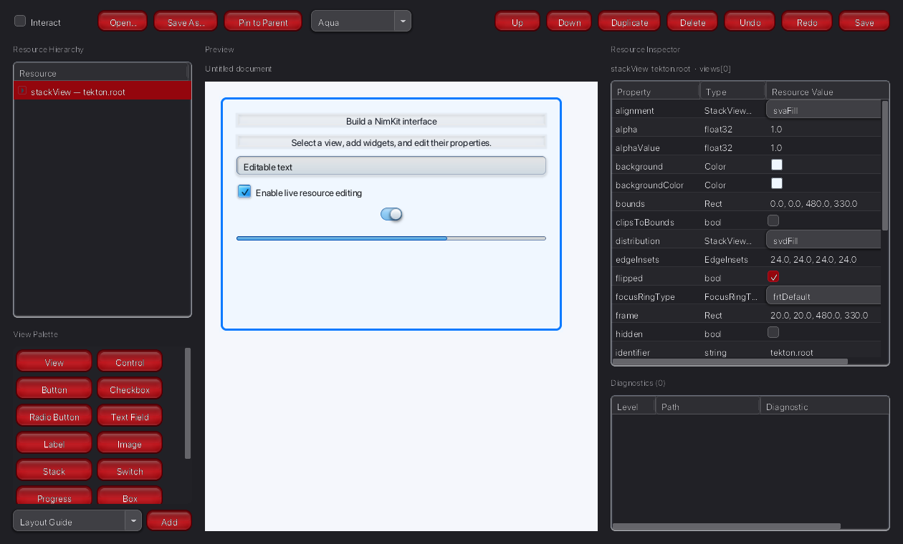

# Tekton review

Reviewed on 2026-09-25 against `5513ba37`. This change improves resource authoring;
Tekton still needs the work listed below to become a complete Interface Builder.

## Confirmed problems and fixes

| Problem | Evidence and change |
| --- | --- |
| A title edit rebuilt every widget, rewired the hierarchy, and replaced constraints. | A factory-count regression constructed 100 widgets for one edit. It now constructs one; layout-only changes construct none. Property and layout edits preserve the view hierarchy. Structural changes retain transactional reconstruction. |
| Selection repeatedly rebuilt the resource outline; synchronization repeatedly rebuilt property editors. | Selection now reuses the outline by document revision. Unchanged synchronization does not read inspector properties again. Hover updates only the hover label and ring. |
| Loading another document at revision zero left the previous preview visible. | A save/load regression reproduced the stale title. Synchronization now tracks document identity as well as revision, and recreates asset contexts on file changes. |
| Inspector checkboxes displayed false when a property's default was true. | Unauthored `enabled` now reads its live getter. Reading defaults does not change the resource document. Invalid authored values remain visible as text. |
| Selecting preview controls triggered their actions. | A canvas click toggled a checkbox in the original implementation. The canvas now intercepts design input. Interact explicitly enables normal control behavior. |
| Failed setters could mutate the preview before raising. | A setter that changes a property and then raises is now rolled back, including the attempted property. The preview revision remains unchanged. |
| Decimal input could be accepted as an empty value for numeric properties. | Failed integer parsing now clears partial results before trying the float parser. Slider and stepper edits exercise this path. |
| A preview root could shrink when constraints were added to its children. | Canvas constraints retain authored root frames at priority 999, allowing required authored constraints to override them. The pin-to-parent workflow checks rendered geometry. |
| New documents had no working Save flow. | Save commits the active editor and prompts for a CBOR destination; Save As and Open are available in the toolbar. |
| Non-view resources could only be inspected. | Typed flat-record operations and inspectors now cover guides, constraints, windows, commands, image source metadata, catalog metadata, and theme metadata. Grouped undo, invalid draft recovery, and save/reload are covered by the shared Tekton runner. |

Preview mouse picking uses an identity lookup table instead of scanning all resource
views at every ancestor. Property conversion contexts retain only images and
localization data. Structural reconciliation retires the staging layout and replaces
its identity maps so the preview does not retain an unused second view graph.

## Measurements

`nim r tests/benchmark_tekton.nim` creates a document, selects 40 widgets, performs
10 title edits, and synchronizes an unchanged document 40 times. These are model and
editor timings, without a native window or GPU rendering. Measured on macOS arm64,
Nim 2.2.12, release ARC, using the same Atlas dependencies for both revisions.
The table reports medians of three alternating original/updated runs. Other local
builds were active, so absolute timings include contention.

| Workload | Original, 100 widgets | Updated, 100 widgets | Original, 300 widgets | Updated, 300 widgets |
| --- | ---: | ---: | ---: | ---: |
| Open document | 153.28 ms | 179.12 ms | 242.43 ms | 187.84 ms |
| Select widget | 5.490 ms | 3.700 ms | 17.909 ms | 3.443 ms |
| Edit title | 37.754 ms | 3.978 ms | 154.158 ms | 7.743 ms |
| Unchanged synchronization | 5.815 ms | 0.001 ms | 17.339 ms | 0.001 ms |

Timings are observations, not CI thresholds. The regression suite asserts bounded
construction work and preserved identities independently of machine speed.

## Authoring workflow

1. Run `nim r src/merenda/tekton.nim`, or pass an existing CBOR document path.
2. Select a container and insert controls. Inspect default and authored properties.
3. Use the resource picker to add guides, constraints, windows, commands, or assets.
4. Edit layout endpoints, anchors, relation, multiplier, constant, priority, and
   activation. Selecting a guide outlines its insets; a constraint highlights its
   endpoint views. Unsatisfied constraints appear after layout in Diagnostics.
5. Pin a freeform child to its parent with one undo action. Deleting a view removes
   its guides and touching constraints in the same action.
6. Choose a preview theme and enable Interact to exercise controls. These preview
   settings do not modify the document. Return to design mode for positioning.
7. Save or Save As, then reopen. Invalid numeric field text must be corrected before
   saving; semantically invalid resource drafts retain the last valid preview.

## Remaining gaps

- Editing controller/menu trees and collection contents: localization strings,
  key binding entries, and theme rules remain read-only.
- Attaching Tekton to an existing running application, preserving its state, and
  synchronizing external mutations. The separate NimKit `showViewInspector` remains
  available for inspection inside an application.
- Application logic generation and controller/outlet/action connection authoring.
- Visual reparenting, multi-selection, anchor dragging, alignment, snapping, and
  palette coverage for the remaining model-backed controls.
- Ambiguity analysis and attribution of solver conflicts to generated constraints.
- Broader performance measurements with complex layouts, assets, and native rendering.

See [PLAN.md](../PLAN.md) for follow-up work. The focused checks live in
`tests/tekton/regressions.nim` and `tests/tekton/layout_authoring.nim`, imported by
`tests/ttekton.nim`.

## Verification

All four shared runners passed on macOS arm64 with Nim 2.2.12. The full
`atlas-run tests` run identified an outdated expected registry-kind list in NimKit;
after adding slider and stepper, `atlas-run tests tests/tnimkit.nim` passed.
All 41 Tekton tests also passed with address and undefined-behavior sanitizers under
ARC and ORC. The example bundle compiled, the shared-runner import check passed,
and the screenshot above was rendered using Metal.
